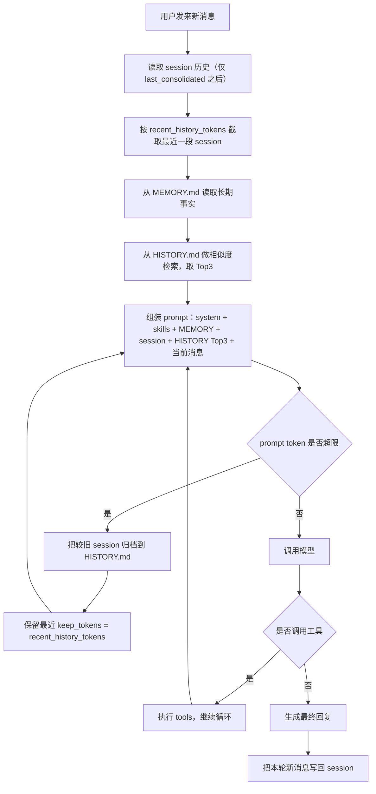

# README_local

本文件是这台机器上这份 `nanobot` 仓库的本地使用说明，面向当前环境：

- 仓库目录：`/Users/wangyc/Desktop/projects/nanobot`
- 配置文件：`/Users/wangyc/.nanobot/config.json`
- 工作区：`/Users/wangyc/.nanobot/workspace`
- 会话目录：`/Users/wangyc/.nanobot/sessions`

说明：

- 这里记录的是“你本地这份代码现在怎么工作”，不是上游 README 的原样翻译。
- 不包含任何明文密钥；涉及配置时只写结构和作用。

## 1. 项目是什么

`nanobot` 是一个轻量级个人 AI Agent 框架。核心能力是：

- 接收用户消息
- 组装上下文、记忆、skills
- 调用 LLM
- 让模型用 tools 真正执行任务
- 把结果返回到 CLI 或聊天渠道

它支持两种主要运行形态：

- 直接 CLI 对话：`nanobot agent`
- 网关模式接入聊天平台：`nanobot gateway`

## 2. 当前这台机器上的实际配置

当前本地配置的关键状态：

- 默认工作区：`~/.nanobot/workspace`
- 默认模型：`openai-codex/gpt-5.4`
- 默认 provider：`auto`
- `contextWindowTokens = 400000`
- `maxTokens = 4096`
- `recentHistoryTokens = 24000`
- `historyRecallTopK = 3`
- `historyRecallMaxChars = 1200`
- `QQ` 渠道已启用
- `heartbeat` 已启用，间隔 `1800s`
- `restrictToWorkspace = false`
- 本地已安装 Tavily skill：`/Users/wangyc/.nanobot/workspace/skills/tavily-search/SKILL.md`

当前工作区文件：

- `AGENTS.md`：工作区级指令
- `USER.md`：用户画像/偏好
- `SOUL.md`：人格/风格
- `TOOLS.md`：工具说明
- `HEARTBEAT.md`：周期性待办
- `memory/MEMORY.md`：长期事实记忆
- `memory/HISTORY.md`：历史事件归档

## 3. 本地代码相对上游的重要定制

这份仓库不等于原版上游。你本地已经叠加了多轮定制，关键点如下。

### 3.1 搜索默认改为 Tavily，不再使用内置 `web_search`

当前主 agent 和 subagent 都不再注册 `web_search`，只保留：

- `web_fetch`：抓取指定 URL 内容
- `exec`：通过 shell 执行 Tavily 脚本

联网搜索默认策略已经改成：

- `node ~/.nanobot/workspace/skills/tavily-search/scripts/search.mjs "query"`
- `node ~/.nanobot/workspace/skills/tavily-search/scripts/extract.mjs "url"`

原因：

- 原 `web_search` 依赖 Brave API key
- 你本地实际可用的是 Tavily

### 3.2 执行型任务优先直接做，不再先解释一大段

已经改过系统提示和模板，当前策略是：

- 普通聊天：正常回答
- 明确可执行任务：直接调用工具执行
- 只有遇到阻塞时才解释和追问

### 3.3 记忆系统已重构

这一轮是最近最大改动，和上游默认行为不同：

- `MEMORY.md` 只允许“用户明确要求写入”时更新
- 每次回答前，强制从 `HISTORY.md` 检索最相关 Top3 注入上下文
- 归档触发从“按消息数/session”改成“按 token 预算”

补充：

- 2026-03-07 修复过一个 session 落盘 bug
- 原因是运行过程中 `initial_messages` 被原地扩展，保存时错误地按扩展后的长度跳过，导致新消息没有写进 `workspace/sessions/*.jsonl`
- 现已改成在 agent 运行前记录固定的 `initial_count` 再保存
- 这个修复只影响后续新消息；bug 期间没落盘的历史消息无法自动恢复

详细见后面的“记忆系统”章节。

### 3.4 中文日志与 session 文件可直接阅读

已经改成 `json.dumps(..., ensure_ascii=False)`，所以：

- 子代理日志不会再把中文写成 `\uXXXX`
- session JSONL 也直接保存中文

### 3.5 QQ 渠道本地增强

已经做过两类修补：

1. URL 清洗
- QQ 私聊不允许机器人直接发 URL
- 发送前会把 `http://` / `https://` 替换成 `[链接已省略]`

2. 回复去重修复
- QQ 对同一个 `msg_id` 的多次回复要求不同 `msg_seq`
- 本地已补了按 `msg_id` 递增 `msg_seq` 的逻辑
- 这样同一轮任务里发多次进度消息/最终消息不会再被判重

3. 仅发送最终结果
- QQ 渠道不再接收 agent 的中间 progress
- 不再把模型思考内容、工具提示、过程性说明发到 QQ
- QQ 只发送最后的正式结果消息
- CLI 仍然可以显示这些中间过程

注意：

- 这些 QQ 修复如果还没重启 QQ bot 进程，不会生效
- 当前这些改动还处于未提交状态

### 3.6 其他本地改动

- 支持并启用过 MCP 相关改动
- 从 `upstream/main` 同步过多次
- 轮转日志 `botpy.log.*` 已加入 `.gitignore`
- 移植过 `nanobot-redux` 的“执行优先”行为补丁

## 4. 项目核心功能

从功能上看，这个项目可以分成 8 块。

### 4.1 Agent 对话与任务执行

核心类：

- `nanobot/agent/loop.py`
- `nanobot/agent/context.py`
- `nanobot/agent/memory.py`

职责：

- 接收消息
- 构建上下文
- 调用模型
- 处理工具调用
- 保存会话
- 做记忆归档

### 4.2 文件系统操作

默认可用工具：

- `read_file`
- `write_file`
- `edit_file`
- `list_dir`

作用：

- 读写代码
- 修改文档
- 输出 Markdown / HTML / 报告到桌面或工作区

### 4.3 Shell 执行

工具：

- `exec`

作用：

- 执行 shell 命令
- 跑脚本
- 调用外部 CLI，例如 `gh`、`node`、`grep`、`rg`

### 4.4 网页抓取

工具：

- `web_fetch`

作用：

- 抓取指定 URL 的 HTML / 文本内容

说明：

- 当前本地没有让模型直接用 `web_search`
- 搜索请走 Tavily skill

### 4.5 消息发送与进度回传

工具：

- `message`

作用：

- 任务过程中往原会话发进度
- 最终把结果发回当前渠道

### 4.6 子代理

工具：

- `spawn`

作用：

- 后台起一个 subagent 做子任务
- 完成后再把结果汇报给主会话

### 4.7 定时任务

工具：

- `cron`

CLI：

- `nanobot cron ...`

作用：

- 定时执行 agent 任务
- 可选把结果投递到指定渠道

### 4.8 聊天渠道网关

支持渠道：

- Telegram
- Discord
- WhatsApp
- Feishu
- Mochat
- DingTalk
- Slack
- Email
- QQ
- Matrix

你当前本机重点在用：

- QQ
- CLI

## 5. 当前主 agent 默认注册的 tools

主 agent 在启动时实际注册的工具是：

- `read_file`
- `write_file`
- `edit_file`
- `list_dir`
- `exec`
- `web_fetch`
- `message`
- `spawn`
- `cron`（仅在注入 cron service 时）
- MCP tools（仅在配置并连接成功时动态注册）

对应代码在：

- `nanobot/agent/loop.py`
- `nanobot/agent/tools/*`

subagent 当前默认工具更少：

- `read_file`
- `write_file`
- `edit_file`
- `list_dir`
- `exec`
- `web_fetch`

## 6. Skills

### 6.1 仓库内置 skills

当前仓库内置技能目录：

- `nanobot/skills/clawhub/SKILL.md`
- `nanobot/skills/cron/SKILL.md`
- `nanobot/skills/github/SKILL.md`
- `nanobot/skills/memory/SKILL.md`
- `nanobot/skills/skill-creator/SKILL.md`
- `nanobot/skills/summarize/SKILL.md`
- `nanobot/skills/tmux/SKILL.md`
- `nanobot/skills/weather/SKILL.md`

这些 skill 的加载顺序是：

1. 先加载工作区 `workspace/skills/*`
2. 再加载内置 `nanobot/skills/*`
3. 同名时，工作区优先覆盖内置

### 6.2 你本地额外安装的 skill

当前本地实际存在的 workspace skill：

- `tavily-search`
- `agent-browser`

路径：

- `/Users/wangyc/.nanobot/workspace/skills/tavily-search/SKILL.md`
- `/Users/wangyc/.nanobot/workspace/skills/agent-browser/SKILL.md`

用途：

- 搜索网页
- 抽取网页正文
- 做新闻/舆情/研究资料搜集
- 浏览器自动化
- 抓取结构化页面元素
- 表单填写、点击、截图、导出 PDF
- 适合需要“真正打开网页并交互”的场景

依赖：

- `node`
- `TAVILY_API_KEY`
- `agent-browser` skill 本身要求 `node`、`npm`

### 6.3 `agent-browser` skill 说明

这是一个浏览器自动化 skill，不是普通 HTTP 抓取。

适合的任务：

- 打开网页并读取可交互元素
- 点击按钮、填写输入框、翻页
- 抓取页面上的结构化内容
- 对网页做截图或导出 PDF

典型命令风格：

```bash
agent-browser open <url>
agent-browser snapshot -i
agent-browser click @e1
agent-browser fill @e2 "text"
agent-browser screenshot path.png
agent-browser pdf output.pdf
```

和 `web_fetch` 的区别：

- `web_fetch`：更像“下载网页源码/正文”
- `agent-browser`：更像“真的开浏览器去操作页面”

### 6.4 skill 的使用方式

skill 本质上不是 Python 插件，而是“给 agent 的使用手册”。

典型流程：

1. `SkillsLoader` 扫描 skill 目录
2. 把 skill 摘要写进系统上下文
3. 模型按 skill 说明自己决定调用哪些工具
4. 像 Tavily 这类 skill，实际上会通过 `exec` 去跑对应脚本

## 7. 记忆系统

这是你本地当前最重要的定制之一。

### 7.1 总体流程图



这个图里最关键的 3 个存储层：

- `session`：短期工作记忆，保存最近对话原文
- `MEMORY.md`：长期事实记忆，保存用户明确要求长期记住的内容
- `HISTORY.md`：历史归档记忆，保存旧会话的压缩摘要/事件

### 7.2 文件结构

- `memory/MEMORY.md`：长期事实记忆
- `memory/HISTORY.md`：历史事件归档

### 7.3 `MEMORY.md` 当前规则

当前规则不是“自动总结就写长期记忆”，而是：

- 只有用户在当前轮明确要求“写入长期记忆 / save to memory / 写入 MEMORY.md”等，才允许更新
- 否则模型即使想写，也会被文件工具拦截

这避免了长期记忆被模型乱写、误写。

### 7.4 `HISTORY.md` 当前规则

每次回答前：

1. 先读取 `HISTORY.md`
2. 对当前用户问题做相似度检索
3. 选最相关 Top3
4. 作为只读历史注入上下文

当前相似度算法是轻量 lexical hybrid：

- 英文单词匹配
- 中文块匹配
- 中文 2-gram
- substring 命中
- exact query bonus

这不是 embedding 检索，但比纯 grep 更稳。

### 7.5 归档逻辑

当前归档不再按固定消息条数触发，而是按 token 预算触发：

- 先保留最近一段会话历史
- 如果 prompt token 超过 `contextWindowTokens - maxTokens`
- 就归档旧消息到 `HISTORY.md`

这里最关键的一行参数是：

- `keep_tokens=self.recent_history_tokens`

它的意思不是“总共只允许这么多 token”，而是：

- 在执行归档时，**至少尽量保留最近这段 token 预算范围内的 session 原文**
- 你当前配置里 `recentHistoryTokens = 24000`
- 所以归档时，系统会尝试：
  - 把更旧的消息挪去 `HISTORY.md`
  - 但把最近大约 `24000 tokens` 的会话原文继续留在 session 里

换句话说：

- `recent_history_tokens` 决定“短期工作记忆保留多少”
- `keep_tokens` 就是归档时实际采用的这个保留预算

它在代码里有两处作用：

1. 构建 prompt 时
- session 只取最近 `recent_history_tokens` 这段历史进入上下文

2. 触发归档时
- 旧消息被归档
- 最近 `recent_history_tokens` 这段尽量不归档

可以用一个例子理解：

- 假设当前 session 原始历史累计约 `60000 tokens`
- 配置 `recentHistoryTokens = 24000`

那么归档时更接近下面这个效果：

- 前面约 `36000 tokens` 的旧历史 -> 归档到 `HISTORY.md`
- 后面约 `24000 tokens` 的最近历史 -> 继续保留在 session

所以归档不是“清空 session”，而是“只清旧的，留新的”。

### 7.6 为什么归档后不会立刻失忆

归档后，agent 仍然有 3 层记忆来源：

1. 最近一段 session
- 也就是上面说的 `keep_tokens = recent_history_tokens`
- 这是当前任务最直接的上下文

2. `MEMORY.md`
- 长期事实仍然始终会进入上下文

3. `HISTORY.md` Top3 检索
- 旧历史虽然不再整段保留在 session
- 但每轮仍会从 `HISTORY.md` 里召回最相关的 3 条

因此归档后的真实状态不是“没记忆”，而是：

- 最近对话保留原文
- 更旧对话被压缩
- 需要时通过检索再召回

真正会弱化的是：

- 很早之前的细节
- 没写进 `MEMORY.md`
- 也没有被很好地总结进 `HISTORY.md`
- 同时检索时又没排进 Top3

这种信息才有可能逐步丢失。

### 7.7 当前记忆系统的优点和边界

优点：

- 不会轻易污染长期记忆
- 历史可控
- 归档逻辑更贴近大模型上下文限制

边界：

- `HISTORY.md` 检索仍是规则分，不是 embedding / reranker
- 真正成熟的下一步应该是两阶段检索：
  - lexical recall
  - embedding 或 rerank 重排
- 如果 session 没有成功落盘，那么重启进程后这部分短期会话历史会丢失；但 `MEMORY.md` 和 `HISTORY.md` 仍然保留，因此 agent 不是“完全没记忆”

## 8. 会话与 session

session 按 `channel:chat_id` 区分。

例如：

- CLI 默认：`cli:direct`
- QQ 私聊：`qq:<user_openid>`

session 文件在：

- `/Users/wangyc/.nanobot/sessions/*.jsonl`

当前行为：

- 同一个 chat_id 会复用同一个 session
- 发 `/new` 会归档当前会话后清空当前 session

聊天内置命令：

- `/new`：开启新会话
- `/stop`：停止当前任务
- `/help`：显示命令说明

## 9. CLI 命令总览

当前 `nanobot` CLI 主命令如下。

### 9.1 基础命令

```bash
nanobot --version
nanobot onboard
nanobot status
nanobot agent
nanobot gateway
```

说明：

- `nanobot onboard`
  - 初始化 `~/.nanobot/config.json`
  - 初始化 workspace
  - 同步模板文件

- `nanobot status`
  - 查看 config、workspace、model、provider 配置状态

- `nanobot agent`
  - CLI 模式和 agent 直接对话

- `nanobot gateway`
  - 启动网关，接管聊天平台消息

### 9.2 `nanobot agent`

常用：

```bash
nanobot agent
nanobot agent -m "你好"
nanobot agent -m "把 README 总结成中文"
nanobot agent --logs -m "去搜索今天 GitHub 热点并写到桌面"
nanobot agent -s cli:direct
```

参数：

- `-m, --message`：单次消息
- `-s, --session`：指定 session id
- `--markdown / --no-markdown`：CLI 输出是否按 Markdown 渲染
- `--logs / --no-logs`：是否显示运行日志

### 9.3 `nanobot gateway`

常用：

```bash
nanobot gateway
nanobot gateway --port 18790
nanobot gateway --verbose
```

参数：

- `-p, --port`：网关端口
- `-v, --verbose`：更详细日志

### 9.4 channels 子命令

```bash
nanobot channels status
nanobot channels login
```

说明：

- `channels status`：查看各渠道是否启用、配置是否存在
- `channels login`：主要用于 WhatsApp bridge 的二维码登录

### 9.5 cron 子命令

```bash
nanobot cron list
nanobot cron list --all
nanobot cron add --name "daily" --message "总结今天热点" --every 3600
nanobot cron add --name "morning" --message "发日报" --cron "0 9 * * *" --tz Asia/Shanghai
nanobot cron add --name "once" --message "提醒我" --at "2026-03-08T09:30:00"
nanobot cron remove <job_id>
nanobot cron enable <job_id>
nanobot cron enable <job_id> --disable
nanobot cron run <job_id>
nanobot cron run <job_id> --force
```

作用：

- 查看任务
- 添加任务
- 删除任务
- 启用/禁用任务
- 立刻手动执行任务

### 9.6 provider 子命令

```bash
nanobot provider login openai-codex
nanobot provider login github-copilot
```

作用：

- OAuth 登录 provider

你本地已经实际用过：

```bash
nanobot provider login openai-codex
```

## 10. 渠道能力和当前本地重点

### 10.1 QQ

当前你本地重点使用 QQ 私聊模式。

行为特征：

- 机器人收到私聊后，按 `qq:<user_openid>` 建 session
- 默认只发最终结果，不发思考/进度
- URL 会在发送前被清洗
- 多次回复同一条消息时应使用递增 `msg_seq`

如果想开新会话：

```text
/new
```

### 10.2 CLI

CLI 仍是最稳定的调试入口，适合：

- 测工具调用
- 看 logs
- 验证 skill
- 调试 provider / MCP / cron

## 11. MCP

项目支持 MCP，但是否生效取决于：

- `~/.nanobot/config.json` 中 `tools.mcpServers`
- 服务是否可启动
- 工具能否注册成功

当前你本地配置里：

- `mcpServers = {}`

也就是现在默认没有启用额外 MCP server。

如果配置成功，MCP 工具会在 agent 启动后动态注册进默认工具表。

## 12. 常用文件和目录

### 12.1 代码核心入口

- `nanobot/agent/loop.py`：主循环
- `nanobot/agent/context.py`：上下文构建
- `nanobot/agent/memory.py`：记忆读写与归档
- `nanobot/session/manager.py`：session 管理
- `nanobot/cli/commands.py`：CLI 命令入口
- `nanobot/config/schema.py`：配置模型
- `nanobot/providers/*`：不同 LLM provider
- `nanobot/channels/*`：不同聊天渠道
- `nanobot/agent/tools/*`：tools 实现
- `nanobot/agent/skills.py`：skills 加载器

### 12.2 本地数据目录

- `~/.nanobot/config.json`：主配置
- `~/.nanobot/workspace/`：工作区
- `~/.nanobot/sessions/`：会话 JSONL
- `~/.nanobot/history/cli_history`：CLI 输入历史
- `~/.nanobot/workspace/memory/`：记忆文件
- `~/.nanobot/workspace/skills/`：用户级 skills

## 13. 常见用法

### 13.1 直接在 CLI 里执行任务

```bash
nanobot agent --logs -m "上网搜索今天 GitHub 热点，整理成 Markdown，保存到桌面"
```

### 13.2 指定 session

```bash
nanobot agent -s cli:daily -m "继续刚才的任务"
```

### 13.3 启动 QQ / 网关

```bash
nanobot gateway
```

### 13.4 查看渠道状态

```bash
nanobot channels status
```

### 13.5 新建定时任务

```bash
nanobot cron add \
  --name "github-hot" \
  --message "查看 GitHub 今日热点 TOP5，写成 md 放桌面" \
  --cron "0 9 * * *" \
  --tz Asia/Shanghai
```

## 14. 当前已知事项

1. `QQ` 渠道对消息发送限制比较多
- 不能直接发 URL
- 对同一 `msg_id` 的重复回复要求不同 `msg_seq`

2. 搜索能力当前依赖 Tavily skill
- 不是原生 Python search tool
- 需要 `node` 和 `TAVILY_API_KEY`

3. 记忆检索还不是 embedding 方案
- 当前是规则相似度
- 未来可以升级为 hybrid recall + rerank

4. `restrictToWorkspace = false`
- 这意味着 agent 可以读写工作区外文件
- 例如你桌面的 `.md/.html`
- 灵活，但也意味着边界更宽

## 15. 建议的后续改造

如果继续往“更稳定的个人 agent”方向做，优先级建议如下：

1. 把 `HISTORY.md` 检索升级为两阶段检索
- 先 lexical recall
- 再 embedding / reranker

2. 给 QQ 渠道补中文别名命令
- `新建会话`
- `重置会话`

3. 把 Tavily 搜索封装成正式 tool
- 现在是 skill + `exec` 脚本
- 可用，但不够结构化

4. 给记忆系统加可观测性
- 当前轮注入了哪 3 条 history
- 为什么命中
- 触发归档时 token 分布如何

## 16. 一句话总结

你这份本地 `nanobot` 已经不是“原版 ultra-lightweight demo”了，而是一个偏实用的个人 Agent：

- 默认走 Tavily 搜索
- QQ 私聊可用
- 支持 OAuth/Codex
- 记忆系统已改成显式长期记忆 + 历史检索 + token 预算归档
- 能做文件输出、shell 执行、GitHub 操作、定时任务和多渠道消息收发
